## WEB STACK IMPLEMENTATION (LEMP STACK) IN AWS

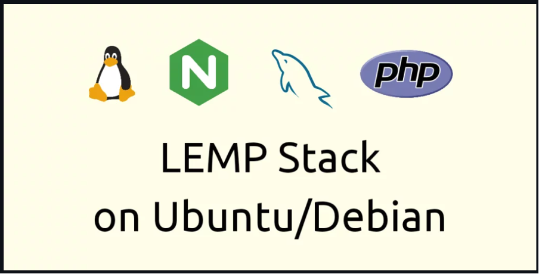

### Introduction:
__LEMP stack is a software stack used for web development, consisting of Linux (the operating system), Nginx (the web server), MySQL (or MariaDB, the database management system), and PHP (or sometimes Python or Perl, the programming language). It's similar to the LAMP stack, but replaces Apache with Nginx for better performance and scalability.__

## Step 1 - Install Nginx Web Server and Update the Firewall

__1.__ __Update and upgrade list of packages in package manager__
```
sudo apt update
sudo apt install nginx
```
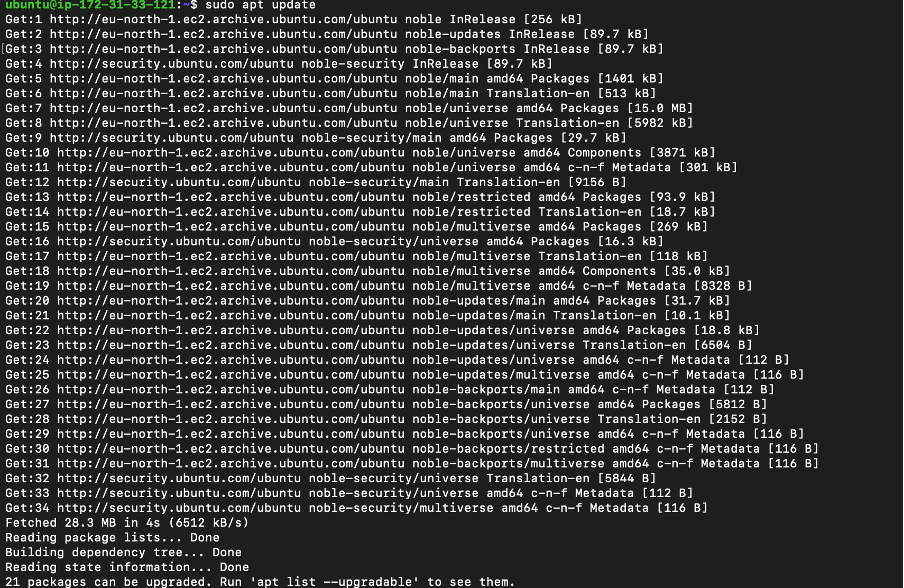
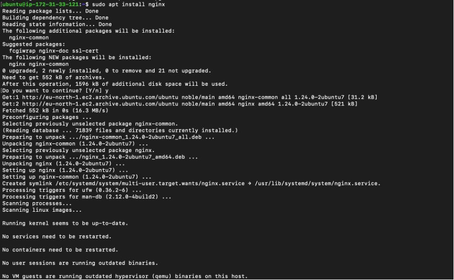

__2.__ __Enable and verify that Nginx Web server is running on as a service on the OS.__
```
sudo systemctl enable nginx
sudo systemctl status nginx
```
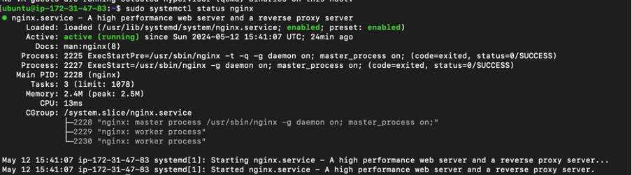

__3.__ __The server is running and can be accessed locally in the ubuntu shell by running the command below:__

```
curl http://localhost:80
OR
curl http://127.0.0.1:80
```
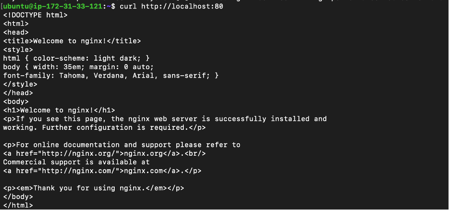

**Test with the public IP address if the Apache HTTP server can respond to request from the internet using the url on a browser.**

```
http://13.60.36.205
```


__4.__ __Another way to retrieve the public ip address other than check the aws console__
```
curl -s http://169.254.169.254/latest/meta-data/public-ipv4
```
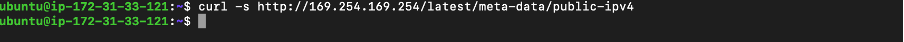

## Step 2 - Install MySQL

__1.__ __Install a relational database (RDB)__

MySQL was installed in this project. It is a popular relational database management system used within PHP environments.
```
sudo apt install mysql-server
```
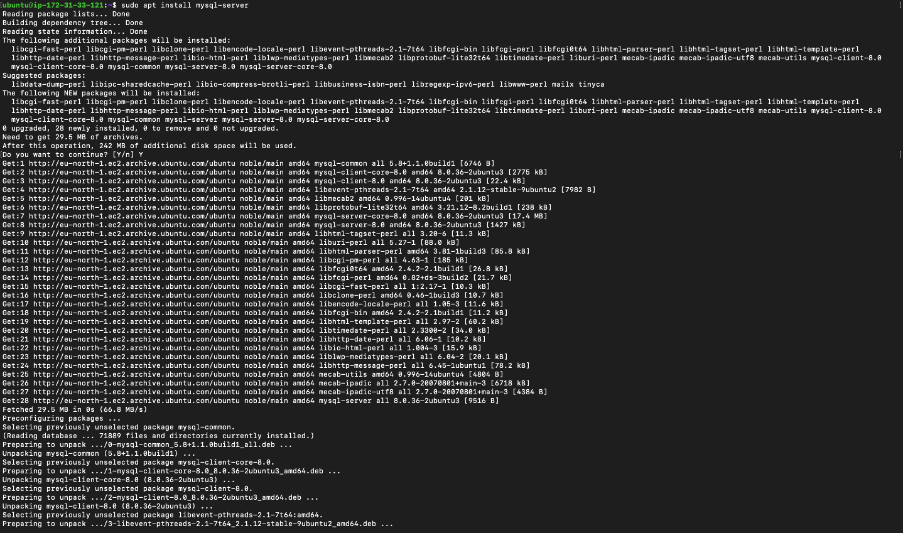
When prompted, install was confirmed by typing y and then Enter.

__2.__ __Enable and verify that mysql is running with the commands below__
```
sudo systemctl enable --now mysql
sudo systemctl status mysql
```


__3.__ __when the installation is finished, log into the MySQL console by typing__

```
sudo mysql
```

This connects to the MySQL server as the administrative database user __root__ infered by the use of __sudo__ when running the command.

__4.__ __Set a password for root user using mysql_native_password as default authentication method.__

Here, the user's password was defined as "Admin123$"
```
ALTER USER 'root'@'localhost' IDENTIFIED WITH mysql_native_password BY 'Admin001$';
```

Exit the MySQL shell
```
exit
```
__5.__ __Run an Interactive script to secure MySQL__

The security script comes pre-installed with mysql. This script removes some insecure settings and lock down access to the database system.
```
sudo mysql_secure_installation
```
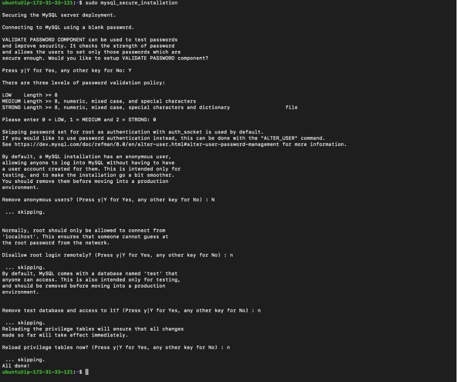

__6.__ __After changing root user password, log in to MySQL console.__

A command prompt for password was noticed after running the command below.
```
sudo mysql -p
```

Exit MySQL shell
```
exit
```

## Step 3 - Install PHP

__1.__ __Install php__
Nginx is installed to serve the content and MySQL is installed to store and manage data.
PHP is the component of the set up that processes code to display dynamic content to the end user.

```
sudo apt install php-fpm php-mysql
```


**Confirm the PHP version**
```
php -v
```

## Step 4 - Configuring Nginx to use PHP Processor

__1.__ __The default directory serving the nginx default page is /var/www/html. Create your document directory next to the default one.__

Created the root web directory for the domain using "mkdir" command
```
sudo mkdir /var/www/projectlEMP
```
__Assign the directory ownership with $USER environment variable which references the current system user.__
```
sudo chown -R $USER:$USER /var/www/projectlEMP
```
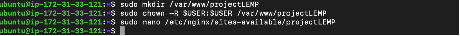

__2.__ __Create and open a new configuration file in Nginx’s “sites-available” directory using nano.__
```
sudo nano /etc/nginx/sites-available/projectlEMP
```

This will creat a new blank file. Past in the bare-bones configuration below:
```
#/etc/nginx/sites-available/projectLEMP
server {
    listen 80;
    server_name projectLEMP www.projectLEMP;
    root /var/www/projectLEMP;

    index index.html index.htm index.php;

    location / {
        try_files $uri $uri/ =404;
    }

    location ~ \.php$ {
        include snippets/fastcgi-php.conf;
        fastcgi_pass unix:/var/run/php/php8.1-fpm.sock;
     }

    location ~ /\.ht {
        deny all;
    }

}
```
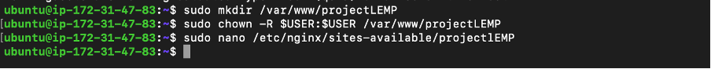

__3.__ __To activate your configuration by liking to the config file from Nginx's sites-enabled directory__


```
sudo ln -s /etc/nginx/sites-available/projectLEMP /etc/nginx/sites-enabled/
```

__4.__  __Then, unlink the default configuration file from the /sites-enabled/ directory__

```
sudo unlink /etc/nginx/sites-enabled/default
```

This will tell Nginx to use the configuration next time it is reloaded.

__5.__ __You can test your configuration for syntax errors by typing__

```
sudo nginx -t
```
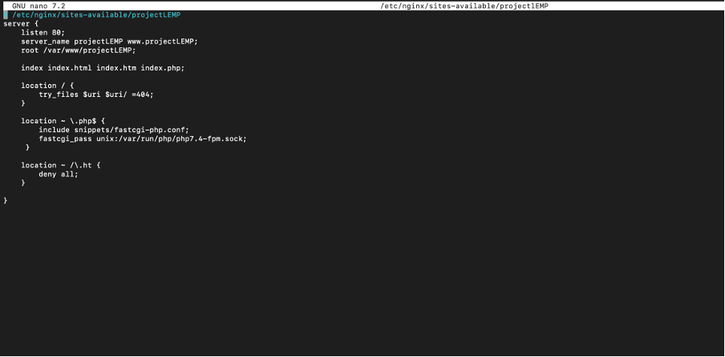

** Disbale default Nginx host that is currently configured to listen on port 80, for this run
```
sudo unlink /etc/nginx/sites-enabled/default
```

__6.__ __When you are ready, reload Nginx to apply the changes:__
```
sudo systemctl reload nginx
```
**Your new website is now active, but the web root /var/www/projectLEMP is still empty. Create an index.html file in that location so that we can test that your new server block works as expected:**
```
sudo echo 'Hello LEMP from hostname' $(curl -s http://169.254.169.254/latest/meta-data/public-hostname) 'with public IP' $(curl -s http://169.254.169.254/latest/meta-data/public-ipv4) > /var/www/projectLEMP/index.html
```

__7.__ __When you are ready, reload Nginx to apply the changes:__
```
http://13.60.36.205
```
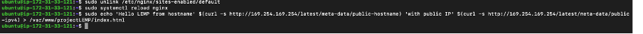
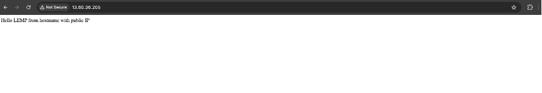

## Step 5 –Testing PHP with Nginx

Your LEMP stack should now be completely set up. You can test it to validate that Nginx can correctly hand .php files off to your PHP processor.

You can do this by creating a test PHP file in your document root.

__1.__ __Open a new file called info.php within your document root in your text editor:__

```
vi /var/www/projectLEMP/info.php
```

Type or paste the following lines into the new file. This is valid PHP code that will return information about your server:

```
<?php
phpinfo();
```

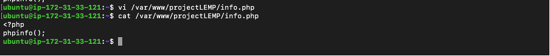

__2.__ __You can now access this page in your web browser by visiting the domain name or public IP address you’ve set up in your Nginx configuration file, followed by /info.php:__

```
http://13.60.36.205/info.php
or 
serverdomain/info.php
```

After checking the relevant information about your PHP server through that page, it’s best to remove the file you created as it contains sensitive information about your PHP environment and your Ubuntu server. You can use rm to remove that file:

```
sudo rm /var/www/projectLEMP/info.php
```
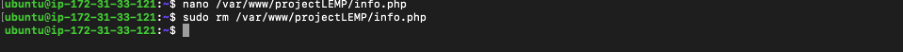

## Step 6 — Retrieving data from MySQL database with PHP

__1.__ __First, connect to the MySQL console using the root account:__

```
sudo mysql
```

__2.__ __To create a new database, run the following command from your MySQL console:__

```
mysql> CREATE DATABASE 'example_database';
```


__3.__ __The following command creates a new user named example_user, using mysql_native_password as default authentication method. We’re defining this user’s password as password, but you should replace this value with a secure password of your own choosing.__

```
mysql> CREATE USER 'eddy'@'%' IDENTIFIED WITH mysql_native_password BY 'Password.1'

mysql> GRANT ALL ON example_database.* TO 'example_user'@'%';
```

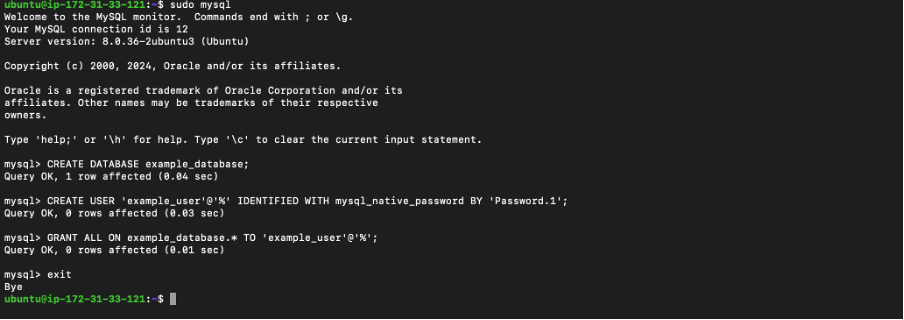

__4.__ __Now exit the MySQL shell with:__

```
mysql> exit
```

__5.__ __You can test if the new user has the proper permissions by logging in to the MySQL console again, this time using the custom user credentials:__

```
mysql -u example_user -p
```

__6.__ __Confirm that you have access to the example_database database:__

```
mysql> SHOW DATABASES;
```

__7.__ __We’ll create a test table named todo_list. From the MySQL console, run the following statement:__

```
mysql> CREATE TABLE example_database.todo_list (
    -> item_id INT AUTO_INCREMENT,
    -> content VARCHAR(255),
    -> PRIMARY KEY(item_id)
    -> );
```


__8.__ __Insert a few rows of content in the test table. You might want to repeat the next command a few times, using different values:__

```
mysql> INSERT INTO example_database.todo_list (content) VALUES ("My first important item");

mysql> INSERT INTO example_database.todo_list (content) VALUES ("My second important item");


mysql> INSERT INTO example_database.todo_list (content) VALUES ("My third important item");


mysql> INSERT INTO example_database.todo_list (content) VALUES ("this is my final important item");

```

__9.__ __To confirm that the data was successfully saved to your table, run:__

```
mysql> SELECT * FROM example_database.todo_list;
```

```
Output
+---------+---------------------------------+
| item_id | content                         |
+---------+---------------------------------+
|       1 | My first important item         |
|       2 | My second important item        |
|       3 | My third important item         |
|       4 | this is my final important item |
+---------+---------------------------------+

```
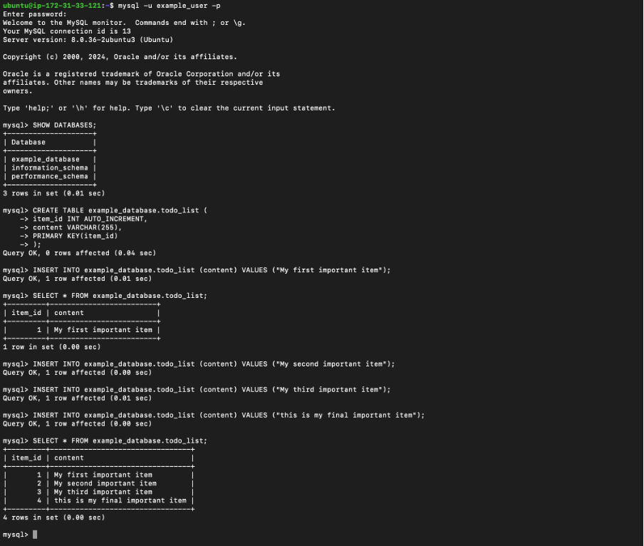
__10.__ __After confirming that you have valid data in your test table, you can exit the MySQL console:__

```
mysql> exit
```

Now you can create the PHP script that will connect to MySQL and query for your content.

__11.__ __Create a new PHP file in your custom web root directory using your preferred editor. We’ll use nano for that:__

```
nano /var/www/projectLEMP/todo_list.php
```

The following PHP script connects to the MySQL database and queries for the content of the todo_list table, exhibiting the results in a list. If there’s a problem with the database connection, it will throw an exception.

__12.__ __Copy this content into your todo_list.php script:__

```
<?php
$user = "example_user";
$password = "Password.1";
$database = "example_database";
$table = "todo_list";

try {
  $db = new PDO("mysql:host=localhost;dbname=$database", $user, $password);
  echo "<h2>TODO</h2><ol>"; 
  foreach($db->query("SELECT content FROM $table") as $row) {
    echo "<li>" . $row['content'] . "</li>";
  }
  echo "</ol>";
} catch (PDOException $e) {
    print "Error!: " . $e->getMessage() . "<br/>";
    die();
}
```

_Save and close the file when you’re done editing._

You can now access this page in your web browser by visiting the domain name or public IP address configured for your website, followed by /todo_list.php:

```
http://13.60.36.205/todo_list.php
```

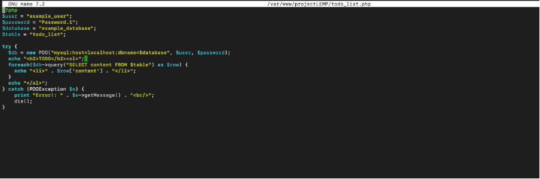

### That means your PHP environment is ready to connect and interact with your MySQL server

## Conclusion

We’ve built a flexible foundation for serving PHP websites and applications to your visitors, using Nginx as web server and MySQL as database system.<br><br>

# Thank You

